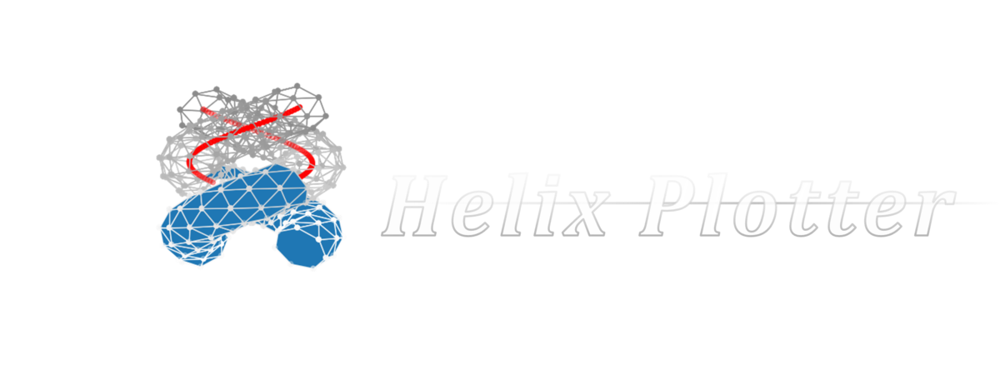

<br>
<br>
<br>
<br>
<br>
<br>
<br>
<br>
<br>
<br>
<br>
<br>


<h1>Try It</h1>
<hr>

```python
from helix_plotter import Helix
from math import pi
```


```python
helix = Helix()
helix.cylindrical_nested(
    rh1 = pi/2, rh2 = pi/3,
     rc = pi/6,  dc = 1,
      p = 2*pi,
     d1 =    1,  d2 = 1,
     t1 =    1,  t2 = 5,
      m =    7,   n = 37
    ) 
helix.surface()
```


```python
helix.cylindrical_sextuple(
    rh1a =   2, rh1b =  2,
    rh2a =   1, rh2b =  1,
      rc = 0.7, p    = -9,
    dc1a =   1, dc1b =  1,
    dc2a =   1, dc2b =  1,
     d1a =   1,  d1b =  1,
     d2a =   1,  d2b = -1,
     t1a =   1,  t1b =  1,
     t2a = 2.5,  t2b =  3,
       m =   3,  n   = 50
    )
helix.surface( color1 = 'pink', color2 = 'purple' )
```
