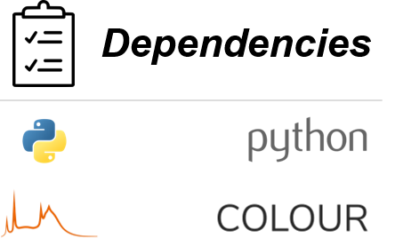
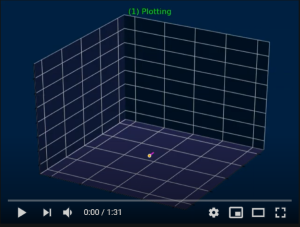

<p align="left">
    
</p>
<p align="left">
    
</p>
<hr>
<p aling="justify">
    <i>
        This program generates cool 3D surface plots of nested cylindrical helices using Python's inbuilt library Matplotlib.
        It can create regular cylindrical helices, double cylindrical helices, cylindrical nested helices, 
        double cylindrical nested helices and cylindrical sextuple helices (double double cylindrical nested helices).
    </i>
</p>
<h1>Algorithm</h1>
<p align="justify">
    The mathematical formula for a nested helix defines a curve. It does not define a cylindrical surface or the orientation of polygons used to construct the surface. 
    Therefore, a formula was not used. Instead, the helices are contructed algorithmically. The algorithm is demonstrated in the video below.
</p>
<hr>

[](https://www.youtube.com/watch?v=RbBxahDmacU)

<hr>
<h1>Examples</h1>
<p align="justify">
    Below are some example plots generated using the helix plotter. All of these structures are cylindrical sextuple helices (double double cylindrical nested helices).
</p>
<h2 align="center">Slinky Helix</p>
<p align="center">
    
</p>
<h2 align="center">Sculpturesque</p>
<p align="center">
    
</p>
<h2 align="center">Lazy Helix</p>
<p align="center">
    
</p>
<h2 align="center">Snakey Helix</p>
<p align="center">
    
</p>
<h2 align="center">Fountain Helix</p>
<p align="center">
    
</p>
<h1>Try It</h1>
<p>
    To generate your own structures, use the script below and experiment with the parameters.
</p>
```python
from helix_plotter import Helix
from math import pi
```


```python
helix = Helix()
helix.cylindrical_nested(
    rh1 = pi/2, # outer helical radius
    rh2 = pi/3, # inner helical radius
     rc = pi/6, # cylidrical radius
     dc =    1, # rotation of circle    
      p = 2*pi, # pitch (hieght after 1 turn)
     d1 =    1, # outer helical rotation (-1 or 1)
     d2 =    1, # inner helical rotation (-1 or 1)
     t1 =    1, # number of outer helical turns
     t2 =    5, # number of innter helical turns
      m =    7, # number of points per circle in each cylinder
      n =   37  # number of circles used to contruct each cylinder
    ) 
helix.surface()
```


```python
helix.cylindrical_sextuple(
    rh1a =   2, # outer helical radius of double helix 1
    rh1b =   2, # outer helical radius of double helix 1
    rh2a =   1, # inner helical radius of double helix 2
    rh2b =   1, # inner helical radius of double helix 2
      rc = 0.7, # cylindrical radius
       p =  -9, # pitch
    dc1a =   1, # rotation of circle in outer helix a in 1
    dc1b =   1, # rotation of circle in outer helix b in 1
    dc2a =   1, # rotation of circle in inner helix a in 2
    dc2b =   1, # rotation of circle in inner helix b in 2
     d1a =   1, # outer helical rotation of helix a in 1
     d1b =   1, # outer helical rotation of helix b in 1
     d2a =   1, # inner helical rotation of helix a in 2
     d2b =  -1, # inner helical rotation of helix b in 2
     t1a =   1, # number of turns in helix a in 1
     t1b =   1, # number of turns in helix b in 1
     t2a = 2.5, # number of turns in helix a in 2
     t2b =   3, # number of turns in helix b in 2
       m =   3, # number of points per circle in each cylinder
       n =  50  # number of circles used to contruct each cylinder
    )
helix.surface( color1 = 'pink', color2 = 'purple' )
```
